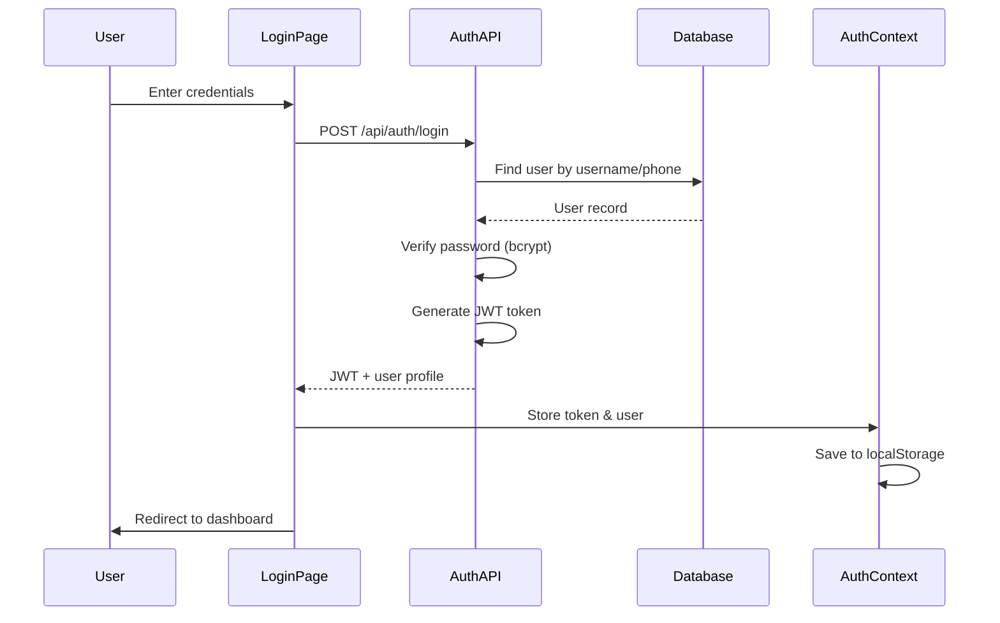
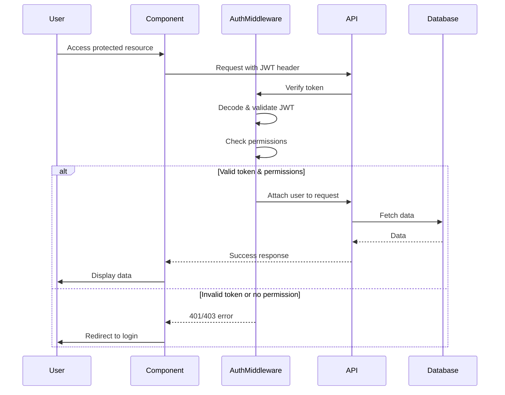

# Design Document: Employee Management and Authentication System

## Overview

This document describes the design for an Employee Management and Authentication System with JWT-based authentication and role-based access control (RBAC). The system enables administrators to manage employee accounts with granular permissions, provides secure authentication for all users, and enforces access control throughout the application.

The design follows the existing Fusion Starter architecture with React frontend, Express backend, MongoDB database, and TypeScript throughout. Authentication is implemented using JWT tokens with bcrypt password hashing, and permissions are enforced both on the frontend (UI rendering) and backend (API endpoints).

## Architecture

### High-Level Architecture

```
┌─────────────────────────────────────────────────────────────┐
│                      Client (React)                          │
│  ┌────────────────┐  ┌──────────────┐  ┌─────────────────┐ │
│  │  Login Page    │  │  Auth Context│  │  Protected      │ │
│  │                │  │  (JWT State) │  │  Routes         │ │
│  └────────────────┘  └──────────────┘  └─────────────────┘ │
│  ┌────────────────┐  ┌──────────────┐  ┌─────────────────┐ │
│  │  Employees     │  │  Permission  │  │  Dynamic        │ │
│  │  Management    │  │  Checker     │  │  Navbar         │ │
│  └────────────────┘  └──────────────┘  └─────────────────┘ │
└─────────────────────────────────────────────────────────────┘
                            │
                    HTTP + JWT Token
                            │
┌─────────────────────────────────────────────────────────────┐
│                    Server (Express)                          │
│  ┌────────────────┐  ┌──────────────┐  ┌─────────────────┐ │
│  │  Auth Routes   │  │  Auth        │  │  Employee       │ │
│  │  /api/auth/*   │  │  Middleware  │  │  Routes         │ │
│  └────────────────┘  └──────────────┘  └─────────────────┘ │
│  ┌────────────────┐  ┌──────────────┐  ┌─────────────────┐ │
│  │  JWT Utils     │  │  Password    │  │  Permission     │ │
│  │  (sign/verify) │  │  Hashing     │  │  Validator      │ │
│  └────────────────┘  └──────────────┘  └─────────────────┘ │
└─────────────────────────────────────────────────────────────┘
                            │
                      MongoDB Database
                            │
┌─────────────────────────────────────────────────────────────┐
│                      Database (MongoDB)                      │
│  ┌────────────────────────────────────────────────────────┐ │
│  │  Users Collection                                       │ │
│  │  - _id, username, passwordHash, role, permissions      │ │
│  │  - firstName, lastName, phoneNumber                    │ │
│  │  - createdAt, updatedAt                                │ │
│  └────────────────────────────────────────────────────────┘ │
└─────────────────────────────────────────────────────────────┘
```

### Authentication Flow



### Authorization Flow



## Components and Interfaces

### Backend Components

#### 1. User Model (server/models/User.ts)

Mongoose schema for storing user/employee data:

```typescript
interface IUser extends Document {
  username: string;
  passwordHash: string;
  firstName: string;
  lastName: string;
  phoneNumber: string;
  role: 'admin' | 'employee';
  permissions: string[];
  isActive: boolean;
  createdAt: Date;
  updatedAt: Date;
}
```

Schema definition:
- `username`: Unique, required, indexed, lowercase, trimmed
- `passwordHash`: Required, never returned in API responses
- `firstName`: Required, trimmed
- `lastName`: Required, trimmed
- `phoneNumber`: Unique, required, indexed, trimmed
- `role`: Enum ['admin', 'employee'], required, default 'employee'
- `permissions`: Array of strings (navbar section identifiers)
- `isActive`: Boolean, default true
- Timestamps: Auto-generated createdAt and updatedAt

Indexes:
- Unique: username, phoneNumber
- Regular: role, isActive

#### 2. Authentication Routes (server/routes/auth.ts)

Express router handling authentication endpoints:

**POST /api/auth/login**
- Request body: `{ identifier: string, password: string }`
  - `identifier` can be username or phone number
- Process:
  1. Find user by username OR phoneNumber (case-insensitive)
  2. Verify password using bcrypt.compare()
  3. Check if user isActive
  4. Generate JWT token with payload: `{ userId, role, permissions }`
  5. Return token and user profile (without passwordHash)
- Response: `{ token: string, user: UserProfile }`
- Errors: 401 for invalid credentials, 403 for inactive user

**POST /api/auth/logout**
- No server-side action needed (JWT is stateless)
- Client removes token from storage
- Response: `{ message: 'Logged out successfully' }`

**GET /api/auth/me**
- Requires authentication (JWT in header)
- Returns current user profile
- Response: `{ user: UserProfile }`
- Errors: 401 if token invalid/expired

**POST /api/auth/refresh**
- Optional: Refresh token mechanism
- Requires valid JWT token
- Generates new token with extended expiration
- Response: `{ token: string }`

#### 3. Employee Routes (server/routes/employees.ts)

Express router for employee management (admin only):

**GET /api/employees**
- Requires: Admin role
- Returns list of all employees
- Response: `{ employees: User[] }`
- Excludes passwordHash from response

**POST /api/employees**
- Requires: Admin role
- Request body: `{ firstName, lastName, phoneNumber, permissions }`
- Process:
  1. Validate input data
  2. Generate username from firstName + lastName
  3. Ensure username uniqueness (append number if needed)
  4. Generate random temporary password (8 chars)
  5. Hash password with bcrypt (10 salt rounds)
  6. Create user record with role='employee'
  7. Return generated credentials
- Response: `{ employee: User, credentials: { username, password } }`
- Errors: 400 for validation errors, 409 for duplicate phone

**GET /api/employees/:id**
- Requires: Admin role
- Returns single employee details
- Response: `{ employee: User }`
- Errors: 404 if not found

**PUT /api/employees/:id**
- Requires: Admin role
- Request body: `{ firstName?, lastName?, phoneNumber?, permissions?, isActive? }`
- Updates employee record
- Response: `{ employee: User }`
- Errors: 404 if not found, 400 for validation errors

**DELETE /api/employees/:id**
- Requires: Admin role
- Soft delete: Sets isActive = false
- Response: `{ message: 'Employee deactivated' }`
- Errors: 404 if not found, 400 if trying to delete admin

#### 4. Authentication Middleware (server/middleware/auth.ts)

Express middleware for JWT verification:

**authenticateToken(req, res, next)**
- Extracts JWT from Authorization header: `Bearer <token>`
- Verifies token using jsonwebtoken.verify()
- Decodes payload: `{ userId, role, permissions }`
- Attaches user data to req.user
- Calls next() if valid
- Returns 401 if token missing/invalid/expired

**requireAdmin(req, res, next)**
- Checks if req.user.role === 'admin'
- Returns 403 if not admin
- Calls next() if admin

**requirePermission(permission: string)**
- Returns middleware function
- Checks if req.user.role === 'admin' OR permission in req.user.permissions
- Returns 403 if no permission
- Calls next() if authorized

Usage example:
```typescript
app.get('/api/employees', authenticateToken, requireAdmin, getEmployees);
app.get('/api/products', authenticateToken, requirePermission('products'), getProducts);
```

#### 5. JWT Utilities (server/utils/jwt.ts)

Helper functions for JWT operations:

**generateToken(payload: TokenPayload): string**
- Creates JWT token with payload
- Sets expiration: 8 hours
- Uses secret from environment variable
- Returns signed token string

**verifyToken(token: string): TokenPayload**
- Verifies and decodes JWT token
- Throws error if invalid/expired
- Returns decoded payload

**TokenPayload interface:**
```typescript
interface TokenPayload {
  userId: string;
  role: 'admin' | 'employee';
  permissions: string[];
}
```

#### 6. Password Utilities (server/utils/password.ts)

Helper functions for password operations:

**hashPassword(password: string): Promise<string>**
- Hashes password using bcrypt
- Salt rounds: 10
- Returns hashed password string

**comparePassword(password: string, hash: string): Promise<boolean>**
- Compares plaintext password with hash
- Returns true if match, false otherwise

**generatePassword(): string**
- Generates random password (8 characters)
- Includes uppercase, lowercase, numbers
- Returns password string

#### 7. Username Generator (server/utils/username.ts)

Helper function for username generation:

**generateUsername(firstName: string, lastName: string): Promise<string>**
- Combines firstName + lastName in lowercase
- Removes spaces and special characters
- Transliterates non-Latin characters (if applicable)
- Checks database for uniqueness
- Appends numeric suffix if duplicate (e.g., "johnsmith2")
- Ensures minimum 3 characters
- Returns unique username

### Frontend Components

#### 1. Auth Context (client/contexts/AuthContext.tsx)

React Context for managing authentication state:

```typescript
interface AuthContextType {
  user: UserProfile | null;
  token: string | null;
  login: (identifier: string, password: string) => Promise<void>;
  logout: () => void;
  isAuthenticated: boolean;
  isAdmin: boolean;
  hasPermission: (permission: string) => boolean;
  loading: boolean;
}
```

**State:**
- `user`: Current user profile or null
- `token`: JWT token string or null
- `loading`: Boolean for initial auth check

**Methods:**
- `login(identifier, password)`: Calls login API, stores token and user
- `logout()`: Removes token and user, redirects to login
- `isAuthenticated`: Computed boolean (token exists and valid)
- `isAdmin`: Computed boolean (user.role === 'admin')
- `hasPermission(permission)`: Checks if user has specific permission

**Storage:**
- Token stored in localStorage: `auth_token`
- User profile stored in localStorage: `auth_user`
- Loads from storage on mount (auto-login)

**Token Expiration Handling:**
- Decodes JWT to check expiration
- Auto-logout if token expired
- Redirects to login page

#### 2. Login Page (client/pages/Login.tsx)

Login form component:

**UI Elements:**
- Input: Username or Phone Number
- Input: Password (type="password")
- Button: Login
- Error message display
- Loading state during authentication

**Behavior:**
- Form validation (required fields)
- Calls AuthContext.login() on submit
- Displays error messages from API
- Redirects to dashboard on success
- Prevents access if already authenticated

**Styling:**
- Centered card layout
- TailwindCSS styling
- Responsive design
- Accessible form elements

#### 3. Protected Route Component (client/components/ProtectedRoute.tsx)

Wrapper component for route protection:

```typescript
interface ProtectedRouteProps {
  children: React.ReactNode;
  requireAdmin?: boolean;
  requirePermission?: string;
}
```

**Behavior:**
- Checks AuthContext.isAuthenticated
- Redirects to /login if not authenticated
- Checks admin requirement if requireAdmin=true
- Checks permission if requirePermission specified
- Renders children if authorized
- Shows "Access Denied" if insufficient permissions

**Usage:**
```typescript
<ProtectedRoute requireAdmin>
  <EmployeesPage />
</ProtectedRoute>

<ProtectedRoute requirePermission="products">
  <ProductsPage />
</ProtectedRoute>
```

#### 4. Employees Page (client/pages/Employees.tsx)

Admin-only page for employee management:

**UI Elements:**
- Table: List of employees (name, phone, role, status)
- Button: Add Employee (opens modal)
- Action buttons per row: Edit, Deactivate
- Search/filter functionality
- Loading and error states

**Features:**
- Fetches employees from API on mount
- Opens EmployeeModal for add/edit
- Displays generated credentials after creation
- Confirms before deactivating employee
- Real-time updates after mutations

**Data Fetching:**
- Uses React Query for data management
- Automatic refetch after mutations
- Optimistic updates for better UX

#### 5. Employee Modal (client/components/EmployeeModal.tsx)

Modal for adding/editing employees:

**Form Fields:**
- Input: First Name (required)
- Input: Last Name (required)
- Input: Phone Number (required)
- Checkboxes: Permissions (multi-select)
  - Dashboard
  - Products (Mahsulotlar)
  - Purchases (Xaridlar)
  - Sales (Savdo)
  - Warehouse (Ombor)
  - Finance (Moliya)
  - Contacts (Aloqalar)
  - Production (Ishlab chiqarish)
  - Ecommerce

**Behavior:**
- Validation: Required fields, phone format
- Submit: POST /api/employees (create) or PUT /api/employees/:id (update)
- Success: Shows generated credentials (create only), closes modal
- Error: Displays error message
- Cancel: Closes modal without saving

**Credentials Display (Create Only):**
- Shows generated username and password
- Copy to clipboard functionality
- Warning: "Save these credentials - password cannot be recovered"
- Requires acknowledgment before closing

#### 6. Dynamic Navbar Component (client/components/Navbar.tsx)

Navigation component with permission-based rendering:

**Navbar Items:**
```typescript
const navbarItems = [
  { path: '/dashboard', label: 'Dashboard', permission: 'dashboard' },
  { path: '/products', label: 'Mahsulotlar', permission: 'products' },
  { path: '/purchases', label: 'Xaridlar', permission: 'purchases' },
  { path: '/sales', label: 'Savdo', permission: 'sales' },
  { path: '/warehouse', label: 'Ombor', permission: 'warehouse' },
  { path: '/finance', label: 'Moliya', permission: 'finance' },
  { path: '/contacts', label: 'Aloqalar', permission: 'contacts' },
  { path: '/production', label: 'Ishlab chiqarish', permission: 'production' },
  { path: '/ecommerce', label: 'Ecommerce', permission: 'ecommerce' },
];
```

**Rendering Logic:**
- Filters items based on AuthContext.hasPermission()
- Admin sees all items
- Employee sees only permitted items
- Employees link only visible to admin

**User Profile Section:**
- Displays user name and role
- Dropdown menu:
  - Profile (view only)
  - Logout button

#### 7. API Client (client/lib/api.ts)

Centralized API client with authentication:

**Configuration:**
- Base URL: `/api`
- Default headers: `Content-Type: application/json`
- Attaches JWT token to all requests

**Methods:**
- `api.get(url, config)`
- `api.post(url, data, config)`
- `api.put(url, data, config)`
- `api.delete(url, config)`

**Interceptors:**
- Request: Adds Authorization header with JWT token
- Response: Handles 401 errors (auto-logout and redirect)
- Response: Handles 403 errors (show access denied message)

**Error Handling:**
- Extracts error messages from API responses
- Throws formatted errors for React Query
- Logs errors in development mode

### Shared Types (shared/api.ts)

Type definitions shared between client and server:

```typescript
// User types
export interface User {
  _id: string;
  username: string;
  firstName: string;
  lastName: string;
  phoneNumber: string;
  role: 'admin' | 'employee';
  permissions: string[];
  isActive: boolean;
  createdAt: string;
  updatedAt: string;
}

export interface UserProfile {
  _id: string;
  username: string;
  firstName: string;
  lastName: string;
  phoneNumber: string;
  role: 'admin' | 'employee';
  permissions: string[];
}

// Auth types
export interface LoginRequest {
  identifier: string;
  password: string;
}

export interface LoginResponse {
  token: string;
  user: UserProfile;
}

export interface CreateEmployeeRequest {
  firstName: string;
  lastName: string;
  phoneNumber: string;
  permissions: string[];
}

export interface CreateEmployeeResponse {
  employee: User;
  credentials: {
    username: string;
    password: string;
  };
}

export interface UpdateEmployeeRequest {
  firstName?: string;
  lastName?: string;
  phoneNumber?: string;
  permissions?: string[];
  isActive?: boolean;
}

// Permission constants
export const PERMISSIONS = {
  DASHBOARD: 'dashboard',
  PRODUCTS: 'products',
  PURCHASES: 'purchases',
  SALES: 'sales',
  WAREHOUSE: 'warehouse',
  FINANCE: 'finance',
  CONTACTS: 'contacts',
  PRODUCTION: 'production',
  ECOMMERCE: 'ecommerce',
} as const;

export type Permission = typeof PERMISSIONS[keyof typeof PERMISSIONS];
```

## Data Models

### User/Employee Schema

MongoDB collection: `users`

```typescript
{
  _id: ObjectId,
  username: string,           // Unique, indexed, lowercase
  passwordHash: string,       // bcrypt hash, never exposed in API
  firstName: string,
  lastName: string,
  phoneNumber: string,        // Unique, indexed
  role: 'admin' | 'employee', // Enum, indexed
  permissions: string[],      // Array of permission identifiers
  isActive: boolean,          // Soft delete flag, indexed
  createdAt: Date,            // Auto-generated
  updatedAt: Date             // Auto-generated
}
```

**Indexes:**
- `username`: Unique index
- `phoneNumber`: Unique index
- `role`: Regular index (for filtering)
- `isActive`: Regular index (for filtering active users)

**Validation Rules:**
- `username`: 3-50 characters, alphanumeric + underscore
- `phoneNumber`: Valid phone format (regex validation)
- `firstName`: 1-50 characters, required
- `lastName`: 1-50 characters, required
- `permissions`: Array of valid permission strings
- `role`: Must be 'admin' or 'employee'

**Default Values:**
- `role`: 'employee'
- `permissions`: [] (empty array)
- `isActive`: true

### Sample Data

**Admin User:**
```json
{
  "_id": "507f1f77bcf86cd799439011",
  "username": "admin",
  "passwordHash": "$2b$10$...",
  "firstName": "System",
  "lastName": "Administrator",
  "phoneNumber": "+998901234567",
  "role": "admin",
  "permissions": [],
  "isActive": true,
  "createdAt": "2024-01-01T00:00:00.000Z",
  "updatedAt": "2024-01-01T00:00:00.000Z"
}
```

**Employee User:**
```json
{
  "_id": "507f1f77bcf86cd799439012",
  "username": "johndoe",
  "passwordHash": "$2b$10$...",
  "firstName": "John",
  "lastName": "Doe",
  "phoneNumber": "+998901234568",
  "role": "employee",
  "permissions": ["dashboard", "products", "sales"],
  "isActive": true,
  "createdAt": "2024-01-15T10:30:00.000Z",
  "updatedAt": "2024-01-15T10:30:00.000Z"
}
```

## Correctness Properties

*A property is a characteristic or behavior that should hold true across all valid executions of a system—essentially, a formal statement about what the system should do. Properties serve as the bridge between human-readable specifications and machine-verifiable correctness guarantees.*


### Employee Management Properties

Property 1: Employee creation with complete data
*For any* valid employee data (firstName, lastName, phoneNumber), creating an employee account should result in a new user record with all required fields populated (username, passwordHash, role, permissions, timestamps).
**Validates: Requirements 1.1, 11.1, 11.5**

Property 2: Username generation and uniqueness
*For any* firstName and lastName combination, the system should generate a username by combining them in lowercase, removing spaces and special characters, and appending a numeric suffix if the username already exists to ensure uniqueness.
**Validates: Requirements 1.2, 12.1, 12.2, 12.3, 12.5**

Property 3: Username transliteration
*For any* firstName and lastName containing non-Latin characters, the system should transliterate them to Latin equivalents when generating the username.
**Validates: Requirements 12.4**

Property 4: Secure password generation
*For any* newly created employee, the system should generate a temporary password that is at least 8 characters long and contains a mix of character types (uppercase, lowercase, numbers).
**Validates: Requirements 1.3, 10.5**

Property 5: Password hashing with bcrypt
*For any* password being stored, the system should hash it using bcrypt with at least 10 salt rounds, and the stored value should never be plaintext.
**Validates: Requirements 1.4, 10.1, 10.3**

Property 6: Credentials returned on creation
*For any* employee creation request, the API response should include both the generated username and the plaintext temporary password.
**Validates: Requirements 1.5**

Property 7: Duplicate phone number rejection
*For any* phone number that already exists in the database, attempting to create a new employee with that phone number should fail with an error.
**Validates: Requirements 1.6, 11.2**

Property 8: Permission assignment and persistence
*For any* set of permissions assigned to an employee, those permissions should be stored as an array and retrievable when fetching the employee's details.
**Validates: Requirements 2.1, 2.4, 11.3**

Property 9: Permission updates apply immediately
*For any* employee with existing permissions, updating their permissions should result in the new permission set being stored and returned in subsequent requests.
**Validates: Requirements 2.2**

Property 10: Default empty permissions
*For any* newly created employee, the permissions array should be empty by default unless explicitly specified during creation.
**Validates: Requirements 2.5**

Property 11: Role validation
*For any* user record, the role field should only contain the values "admin" or "employee", and any attempt to set other values should be rejected.
**Validates: Requirements 11.4**

Property 12: Unique username constraint
*For any* username that already exists in the database, attempting to create a new user with that username should fail with an error.
**Validates: Requirements 11.2**

### Authentication Properties

Property 13: Valid credentials authentication
*For any* user with valid credentials, submitting either their username or phone number along with the correct password should result in successful authentication and a JWT token being generated.
**Validates: Requirements 3.1**

Property 14: Invalid credentials rejection
*For any* login attempt with incorrect password or non-existent username/phone, the system should reject the authentication and return an error without revealing which part was invalid.
**Validates: Requirements 3.2**

Property 15: JWT payload structure
*For any* successfully authenticated user, the generated JWT token should contain userId, role, and permissions in its payload, and this information should be extractable by the authentication middleware.
**Validates: Requirements 3.3, 9.2**

Property 16: JWT expiration time
*For any* generated JWT token, the expiration time should be set to exactly 8 hours from the time of issuance.
**Validates: Requirements 3.4**

Property 17: Login response structure
*For any* successful authentication, the API response should include both the JWT token string and the user profile object (without passwordHash).
**Validates: Requirements 3.5**

Property 18: Password validation with bcrypt
*For any* login attempt, the system should use bcrypt.compare() to validate the provided password against the stored hash, and should never compare plaintext passwords.
**Validates: Requirements 3.6, 10.2**

Property 19: Password hash exclusion from responses
*For any* API response containing user data, the passwordHash field should never be included in the response object.
**Validates: Requirements 10.4**

### Session Management Properties

Property 20: Token storage on authentication
*For any* successful login, the JWT token should be stored in the client's localStorage under the key "auth_token".
**Validates: Requirements 4.1**

Property 21: Token inclusion in authenticated requests
*For any* API request to a protected endpoint, the JWT token should be included in the Authorization header with the format "Bearer <token>".
**Validates: Requirements 4.2**

Property 22: Token removal on logout
*For any* logout action, the JWT token should be removed from localStorage and the user should be redirected to the login page.
**Validates: Requirements 4.4, 7.2, 7.3**

### Authorization Properties

Property 23: Admin unrestricted access
*For any* user with role "admin", all API endpoints and UI sections should be accessible without permission checks.
**Validates: Requirements 5.1**

Property 24: Employee permission enforcement
*For any* employee user attempting to access a navbar section or API endpoint, the system should verify that the required permission exists in the user's permissions array before granting access.
**Validates: Requirements 5.2, 5.5**

Property 25: Access denial for missing permissions
*For any* employee user attempting to access a resource without the required permission, the system should return a 403 Forbidden error and deny access.
**Validates: Requirements 5.3**

Property 26: Dynamic navbar rendering
*For any* authenticated user, the navbar should only display menu items for which the user has permission (or all items if admin).
**Validates: Requirements 5.4, 6.5**

Property 27: Protected endpoint authentication
*For any* protected API endpoint, requests without a valid JWT token should be rejected with a 401 Unauthorized error.
**Validates: Requirements 9.1, 9.3**

Property 28: Public login endpoint
*For any* request to the /api/auth/login endpoint, authentication should not be required and the endpoint should be accessible without a JWT token.
**Validates: Requirements 9.5**

### Employee Management UI Properties

Property 29: Employee list retrieval
*For any* admin user accessing the employees page, the system should return a list of all employees with their firstName, lastName, phoneNumber, role, and isActive status.
**Validates: Requirements 6.1**

Property 30: Employee detail retrieval
*For any* employee ID, fetching that employee's details should return the complete user record including all assigned permissions.
**Validates: Requirements 6.2**

Property 31: Employee update persistence
*For any* employee update request with modified fields (firstName, lastName, phoneNumber, permissions, isActive), the changes should be saved to the database and reflected in subsequent queries.
**Validates: Requirements 6.3**

Property 32: User profile display
*For any* authenticated user, the UI should display their firstName, lastName, phoneNumber, and role in the profile section.
**Validates: Requirements 7.1, 7.4**

### Route Protection Properties

Property 33: Unauthenticated route redirection
*For any* protected route, accessing it without a valid JWT token should redirect the user to the /login page.
**Validates: Requirements 8.1, 8.3**

Property 34: Token validation on route access
*For any* protected route, the system should verify the JWT token's validity (signature and expiration) before rendering the route component.
**Validates: Requirements 8.2**

## Error Handling

### Authentication Errors

**Invalid Credentials (401)**
- Scenario: Wrong password or non-existent user
- Response: `{ error: 'Invalid credentials' }`
- Security: Don't reveal whether username or password was wrong

**Inactive Account (403)**
- Scenario: User account is deactivated (isActive = false)
- Response: `{ error: 'Account is inactive' }`
- Action: Prevent login, contact administrator

**Expired Token (401)**
- Scenario: JWT token has passed expiration time
- Response: `{ error: 'Token expired' }`
- Client action: Clear token, redirect to login

**Invalid Token (401)**
- Scenario: Malformed or tampered JWT token
- Response: `{ error: 'Invalid token' }`
- Client action: Clear token, redirect to login

**Missing Token (401)**
- Scenario: Protected endpoint accessed without Authorization header
- Response: `{ error: 'Authentication required' }`
- Client action: Redirect to login

### Authorization Errors

**Insufficient Permissions (403)**
- Scenario: Employee accessing resource without required permission
- Response: `{ error: 'Insufficient permissions' }`
- Client action: Show "Access Denied" message

**Admin Required (403)**
- Scenario: Non-admin accessing admin-only endpoint
- Response: `{ error: 'Admin access required' }`
- Client action: Show "Access Denied" message

### Validation Errors

**Duplicate Phone Number (409)**
- Scenario: Creating employee with existing phone number
- Response: `{ error: 'Phone number already exists' }`
- Client action: Show error on phone field

**Duplicate Username (409)**
- Scenario: Generated username collision (shouldn't happen with suffix logic)
- Response: `{ error: 'Username generation failed' }`
- Client action: Retry or contact support

**Invalid Phone Format (400)**
- Scenario: Phone number doesn't match validation regex
- Response: `{ error: 'Invalid phone number format' }`
- Client action: Show validation error

**Missing Required Fields (400)**
- Scenario: firstName, lastName, or phoneNumber missing
- Response: `{ error: 'Missing required fields', fields: ['firstName'] }`
- Client action: Highlight missing fields

**Invalid Permission (400)**
- Scenario: Attempting to assign non-existent permission
- Response: `{ error: 'Invalid permission', invalid: ['invalid_perm'] }`
- Client action: Show error message

### Database Errors

**Connection Error (500)**
- Scenario: MongoDB connection lost
- Response: `{ error: 'Database connection error' }`
- Logging: Log full error details server-side
- Client action: Show generic error, retry

**Query Error (500)**
- Scenario: Database query fails
- Response: `{ error: 'Database operation failed' }`
- Logging: Log full error details server-side
- Client action: Show generic error, retry

### Error Handling Strategy

**Server-Side:**
- Use try-catch blocks around all async operations
- Log detailed errors server-side (with stack traces)
- Return sanitized error messages to client
- Use appropriate HTTP status codes
- Never expose sensitive information in errors

**Client-Side:**
- Display user-friendly error messages
- Handle 401 errors globally (auto-logout and redirect)
- Handle 403 errors with "Access Denied" UI
- Show validation errors inline on forms
- Provide retry mechanisms for transient errors
- Log errors to console in development mode

**Error Response Format:**
```typescript
interface ErrorResponse {
  error: string;           // User-friendly message
  code?: string;           // Error code for client handling
  fields?: string[];       // Invalid fields (validation errors)
  details?: any;           // Additional context (dev mode only)
}
```

## Testing Strategy

### Dual Testing Approach

This feature requires both unit tests and property-based tests for comprehensive coverage:

**Unit Tests** focus on:
- Specific examples of authentication flows
- Edge cases (empty strings, special characters, boundary values)
- Error conditions (invalid tokens, missing fields, duplicate data)
- Integration points between components
- Specific UI interactions

**Property-Based Tests** focus on:
- Universal properties that hold for all inputs
- Comprehensive input coverage through randomization
- Invariants that must always be true
- Round-trip properties (hash/verify, encode/decode)
- Security properties (no plaintext passwords, token validation)

Both testing approaches are complementary and necessary. Unit tests catch concrete bugs and validate specific scenarios, while property tests verify general correctness across a wide range of inputs.

### Testing Framework

**Backend Testing:**
- Framework: Vitest
- Property Testing Library: fast-check
- Test Location: `server/**/__tests__/*.spec.ts`
- Configuration: Minimum 100 iterations per property test

**Frontend Testing:**
- Framework: Vitest + React Testing Library
- Property Testing Library: fast-check
- Test Location: `client/**/__tests__/*.spec.tsx`
- Configuration: Minimum 100 iterations per property test

### Property Test Configuration

Each property-based test must:
- Run minimum 100 iterations (due to randomization)
- Reference its design document property in a comment
- Use the tag format: `Feature: employee-management-auth, Property {number}: {property_text}`
- Generate diverse random inputs using fast-check arbitraries
- Verify the property holds for all generated inputs

Example property test structure:
```typescript
import fc from 'fast-check';

describe('Feature: employee-management-auth', () => {
  it('Property 5: Password hashing with bcrypt', async () => {
    await fc.assert(
      fc.asyncProperty(
        fc.string({ minLength: 8, maxLength: 50 }), // Random passwords
        async (password) => {
          const hash = await hashPassword(password);
          
          // Verify it's a bcrypt hash (starts with $2b$ or $2a$)
          expect(hash).toMatch(/^\$2[ab]\$/);
          
          // Verify it's not plaintext
          expect(hash).not.toBe(password);
          
          // Verify we can validate it
          const isValid = await comparePassword(password, hash);
          expect(isValid).toBe(true);
        }
      ),
      { numRuns: 100 }
    );
  });
});
```

### Unit Test Coverage

**Authentication Module:**
- Login with valid username and password
- Login with valid phone and password
- Login with invalid credentials
- Login with inactive account
- Token generation and expiration
- Token verification with valid token
- Token verification with expired token
- Token verification with invalid token
- Logout clears token

**Employee Management Module:**
- Create employee with valid data
- Create employee with duplicate phone (error)
- Create employee with duplicate username (error)
- Update employee information
- Update employee permissions
- Deactivate employee
- List all employees (admin)
- Get employee details (admin)
- Access denied for non-admin

**Authorization Module:**
- Admin accesses all endpoints
- Employee accesses permitted endpoint
- Employee denied access to unpermitted endpoint
- Navbar renders based on permissions
- Protected route redirects unauthenticated user
- Protected route allows authenticated user

**Password Module:**
- Hash password with bcrypt
- Verify correct password
- Reject incorrect password
- Generate random password (length and complexity)
- Never store plaintext passwords

**Username Generation Module:**
- Generate username from names
- Handle duplicate usernames (append suffix)
- Remove spaces and special characters
- Transliterate non-Latin characters
- Ensure minimum length

### Integration Tests

**End-to-End Authentication Flow:**
1. Admin creates employee
2. Employee logs in with generated credentials
3. Employee accesses permitted resources
4. Employee denied access to unpermitted resources
5. Employee logs out
6. Employee cannot access protected resources

**Permission Management Flow:**
1. Admin creates employee with specific permissions
2. Verify employee can access permitted sections
3. Admin updates employee permissions
4. Verify new permissions take effect immediately
5. Verify old permissions no longer work

**Security Tests:**
- Expired tokens are rejected
- Invalid tokens are rejected
- Missing tokens are rejected
- Password hashes never exposed in API
- Admin-only endpoints reject non-admin users
- Permission checks work correctly

### Test Data Generation

**fast-check Arbitraries:**

```typescript
// User data generators
const firstNameArb = fc.string({ minLength: 1, maxLength: 50 });
const lastNameArb = fc.string({ minLength: 1, maxLength: 50 });
const phoneArb = fc.string({ minLength: 10, maxLength: 15 })
  .map(s => '+' + s.replace(/\D/g, ''));

const permissionArb = fc.constantFrom(
  'dashboard', 'products', 'purchases', 'sales',
  'warehouse', 'finance', 'contacts', 'production', 'ecommerce'
);

const permissionsArrayArb = fc.array(permissionArb, { minLength: 0, maxLength: 9 })
  .map(arr => [...new Set(arr)]); // Remove duplicates

const roleArb = fc.constantFrom('admin', 'employee');

const userArb = fc.record({
  firstName: firstNameArb,
  lastName: lastNameArb,
  phoneNumber: phoneArb,
  role: roleArb,
  permissions: permissionsArrayArb,
});

// Password generators
const passwordArb = fc.string({ minLength: 8, maxLength: 50 });

// Token generators
const validTokenPayloadArb = fc.record({
  userId: fc.hexaString({ minLength: 24, maxLength: 24 }),
  role: roleArb,
  permissions: permissionsArrayArb,
});
```

### Continuous Integration

**Pre-commit Hooks:**
- Run unit tests
- Run linting and type checking
- Ensure no console.logs in production code

**CI Pipeline:**
- Run all unit tests
- Run all property-based tests
- Check code coverage (target: 80%+)
- Run integration tests
- Build and deploy to staging

**Test Execution:**
```bash
# Run all tests
pnpm test

# Run specific test file
pnpm test server/routes/__tests__/auth.spec.ts

# Run with coverage
pnpm test --coverage

# Run property tests only
pnpm test --grep "Property"
```

## Security Considerations

### Password Security

**Hashing:**
- Use bcrypt with minimum 10 salt rounds
- Never store plaintext passwords
- Never log passwords (even in development)
- Use timing-safe comparison for password validation

**Generation:**
- Generate strong temporary passwords (8+ chars, mixed case, numbers)
- Encourage password changes on first login (future enhancement)
- Consider password complexity requirements (future enhancement)

**Transmission:**
- Always use HTTPS in production
- Never send passwords in URL parameters
- Never log passwords in server logs

### Token Security

**JWT Configuration:**
- Use strong secret key (minimum 256 bits)
- Store secret in environment variables
- Rotate secrets periodically (future enhancement)
- Set appropriate expiration time (8 hours)

**Token Storage:**
- Store in localStorage (acceptable for this use case)
- Alternative: httpOnly cookies (more secure, future enhancement)
- Clear token on logout
- Clear token on expiration

**Token Validation:**
- Verify signature on every request
- Check expiration time
- Validate payload structure
- Reject malformed tokens

### API Security

**Authentication:**
- Require authentication on all protected endpoints
- Use middleware for consistent enforcement
- Return 401 for authentication failures
- Don't reveal whether username or password was wrong

**Authorization:**
- Check permissions on every request
- Enforce role-based access control
- Return 403 for authorization failures
- Admin role bypasses permission checks

**Input Validation:**
- Validate all user inputs
- Sanitize inputs to prevent injection
- Use Mongoose schema validation
- Return 400 for validation errors

**Rate Limiting:**
- Implement rate limiting on login endpoint (future enhancement)
- Prevent brute force attacks
- Consider account lockout after failed attempts (future enhancement)

### Database Security

**Connection:**
- Use connection string from environment variables
- Use authentication for MongoDB connection
- Use TLS/SSL for database connections in production
- Restrict database access by IP (firewall rules)

**Queries:**
- Use Mongoose models (prevents NoSQL injection)
- Validate ObjectIds before queries
- Use indexes for performance
- Implement query timeouts

**Data Protection:**
- Never expose password hashes
- Implement field-level encryption for sensitive data (future enhancement)
- Regular database backups
- Implement audit logging (future enhancement)

### Frontend Security

**XSS Prevention:**
- React automatically escapes output
- Sanitize any dangerouslySetInnerHTML usage
- Validate and sanitize user inputs
- Use Content Security Policy headers

**CSRF Prevention:**
- JWT in Authorization header (not cookies) prevents CSRF
- If using cookies, implement CSRF tokens (future enhancement)

**Sensitive Data:**
- Don't store sensitive data in localStorage beyond tokens
- Clear sensitive data on logout
- Don't log sensitive data to console

### Environment Variables

Required environment variables:

```env
# Database
MONGODB_URI=mongodb://localhost:27017/erp_system

# JWT
JWT_SECRET=your-super-secret-key-min-256-bits
JWT_EXPIRATION=8h

# Server
PORT=8080
NODE_ENV=production

# Optional
BCRYPT_ROUNDS=10
```

**Security Notes:**
- Never commit .env file to version control
- Use different secrets for dev/staging/production
- Rotate secrets periodically
- Use strong random secrets (not dictionary words)

### Compliance Considerations

**Data Privacy:**
- Store only necessary user data
- Implement data retention policies (future enhancement)
- Provide data export functionality (future enhancement)
- Implement right to deletion (future enhancement)

**Audit Logging:**
- Log authentication attempts (future enhancement)
- Log permission changes (future enhancement)
- Log employee creation/modification (future enhancement)
- Retain logs for compliance period

**Access Control:**
- Principle of least privilege
- Regular permission audits
- Remove access for inactive employees
- Monitor for suspicious activity

## Future Enhancements

### Short-term (Next Sprint)

1. **Password Reset Flow**
   - Forgot password functionality
   - Email/SMS verification
   - Secure reset token generation

2. **Password Change**
   - Force password change on first login
   - Allow users to change their own password
   - Password history (prevent reuse)

3. **Token Refresh**
   - Implement refresh token mechanism
   - Extend session without re-login
   - Revoke refresh tokens on logout

4. **Account Lockout**
   - Lock account after N failed login attempts
   - Automatic unlock after time period
   - Admin can manually unlock

### Medium-term (Next Quarter)

1. **Two-Factor Authentication (2FA)**
   - SMS-based 2FA
   - Authenticator app support
   - Backup codes

2. **Audit Logging**
   - Log all authentication events
   - Log permission changes
   - Log employee management actions
   - Searchable audit trail

3. **Advanced Permissions**
   - Granular permissions (read/write/delete)
   - Resource-level permissions
   - Permission groups/roles
   - Permission inheritance

4. **Session Management**
   - View active sessions
   - Revoke specific sessions
   - Force logout all sessions
   - Session timeout warnings

### Long-term (Future Releases)

1. **Single Sign-On (SSO)**
   - OAuth2/OIDC integration
   - SAML support
   - Social login options

2. **Advanced Security**
   - Biometric authentication
   - Hardware security keys
   - IP whitelisting
   - Geolocation restrictions

3. **Compliance Features**
   - GDPR compliance tools
   - Data export/deletion
   - Consent management
   - Privacy policy acceptance

4. **Analytics**
   - Login analytics
   - Permission usage analytics
   - Security event monitoring
   - User behavior analytics

## Deployment Considerations

### Initial Setup

1. **Database Initialization:**
   - Create MongoDB database
   - Create admin user manually or via seed script
   - Set up indexes

2. **Environment Configuration:**
   - Set all required environment variables
   - Generate strong JWT secret
   - Configure MongoDB connection string

3. **Build and Deploy:**
   - Run `pnpm build`
   - Deploy to hosting platform
   - Ensure HTTPS is enabled

### Seed Script for Admin User

Create initial admin user:

```typescript
// server/utils/seedAdmin.ts
import User from '../models/User';
import { hashPassword } from '../utils/password';

export async function createAdminUser() {
  const existingAdmin = await User.findOne({ role: 'admin' });
  
  if (existingAdmin) {
    console.log('Admin user already exists');
    return;
  }
  
  const adminPassword = process.env.ADMIN_PASSWORD || 'admin123';
  const passwordHash = await hashPassword(adminPassword);
  
  const admin = new User({
    username: 'admin',
    passwordHash,
    firstName: 'System',
    lastName: 'Administrator',
    phoneNumber: '+998901234567',
    role: 'admin',
    permissions: [],
    isActive: true,
  });
  
  await admin.save();
  console.log('Admin user created successfully');
  console.log('Username: admin');
  console.log('Password:', adminPassword);
}
```

### Migration Strategy

If adding to existing system:

1. **Database Migration:**
   - Create User collection
   - Add indexes
   - Migrate existing user data (if any)

2. **Code Integration:**
   - Add authentication middleware to existing routes
   - Update frontend to use AuthContext
   - Add login page and protected routes
   - Update navbar with permission checks

3. **Testing:**
   - Test authentication flow
   - Test permission enforcement
   - Test existing functionality still works
   - Test with different user roles

4. **Rollout:**
   - Deploy to staging first
   - Test thoroughly
   - Create admin and employee accounts
   - Train users on new login process
   - Deploy to production
   - Monitor for issues

### Monitoring

**Key Metrics:**
- Failed login attempts
- Token expiration rate
- API response times
- Error rates by endpoint
- Active user sessions

**Alerts:**
- High rate of failed logins (potential attack)
- Database connection errors
- JWT secret misconfiguration
- Unusual permission access patterns

**Logging:**
- Authentication events (success/failure)
- Authorization failures
- Employee management actions
- System errors

## Conclusion

This design provides a comprehensive, secure, and scalable employee management and authentication system with JWT-based authentication and role-based access control. The system follows security best practices, integrates seamlessly with the existing Fusion Starter architecture, and provides a solid foundation for future enhancements.

Key features:
- Secure JWT-based authentication
- Role-based access control with granular permissions
- Admin-managed employee accounts
- Automatic username generation
- Bcrypt password hashing
- Protected routes and API endpoints
- Dynamic navbar based on permissions
- Comprehensive error handling
- Property-based testing for correctness
- Security-first design

The implementation will follow the task list in tasks.md, with incremental development and testing at each step.
