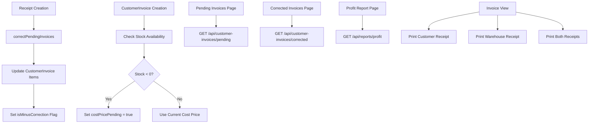

# Design Document: Minus Stock Improvements

## Overview

This design document outlines the technical implementation for enhancing minus stock management in the ERP inventory management system. The system will provide comprehensive tracking of invoices with pending cost prices, automatic cost price correction when stock arrives, accurate profit calculations, and dual receipt printing functionality.

The implementation leverages the existing infrastructure including the `CustomerInvoice` model with `costPricePending` and `isMinusCorrection` fields, and the `correctPendingInvoices` utility function. New components include API endpoints for querying pending and corrected invoices, React pages for viewing these invoices, enhanced profit reporting, and print-optimized receipt templates.

## Architecture

### System Components

The solution follows a three-tier architecture:

1. **Data Layer**: MongoDB models (CustomerInvoice, Receipt, Product, Warehouse)
2. **API Layer**: Express routes for pending invoices, corrected invoices, and profit reports
3. **Presentation Layer**: React pages and components for viewing and managing minus stock data

### Component Interaction Flow



### Data Flow

1. **Minus Stock Sale**: When a product is sold with insufficient stock, the invoice item's `costPricePending` flag is set to true
2. **Stock Arrival**: When a Receipt is created, `correctPendingInvoices` is called for each product
3. **Cost Correction**: The utility updates all pending invoice items with the actual cost price
4. **Reporting**: Profit reports query invoices and calculate margins using corrected cost prices
5. **Printing**: Receipt templates render invoice data in customer-facing and warehouse-facing formats

## Components and Interfaces

### Backend Components

#### 1. API Route: Pending Invoices

**File**: `server/routes/customer-invoices.ts` (extend existing)

**Endpoint**: `GET /api/customer-invoices/pending`

**Query Parameters**:
- `startDate` (optional): ISO date string for filtering
- `endDate` (optional): ISO date string for filtering
- `customerId` (optional): MongoDB ObjectId for customer filtering

**Response Interface**:
```typescript
interface PendingInvoiceResponse {
  _id: string;
  invoiceNumber: string;
  customerName: string;
  invoiceDate: string;
  totalAmount: number;
  pendingItemsCount: number;
  items: Array<{
    productName: string;
    quantity: number;
    costPricePending: boolean;
  }>;
}
```

**Implementation Logic**:
```typescript
// Query invoices where at least one item has costPricePending = true
const query = {
  'items.costPricePending': true
};

// Apply filters
if (startDate) query.invoiceDate = { $gte: new Date(startDate) };
if (endDate) query.invoiceDate = { ...query.invoiceDate, $lte: new Date(endDate) };
if (customerId) query.customer = customerId;

// Execute query with projection
const invoices = await CustomerInvoice.find(query)
  .sort({ invoiceDate: -1 })
  .lean();

// Calculate pending items count for each invoice
const result = invoices.map(inv => ({
  ...inv,
  pendingItemsCount: inv.items.filter(item => item.costPricePending).length
}));
```

#### 2. API Route: Corrected Invoices

**File**: `server/routes/customer-invoices.ts` (extend existing)

**Endpoint**: `GET /api/customer-invoices/corrected`

**Query Parameters**:
- `startDate` (optional): ISO date string for filtering
- `endDate` (optional): ISO date string for filtering
- `productId` (optional): MongoDB ObjectId for product filtering

**Response Interface**:
```typescript
interface CorrectedInvoiceResponse {
  _id: string;
  invoiceNumber: string;
  customerName: string;
  invoiceDate: string;
  updatedAt: string;
  totalAmount: number;
  items: Array<{
    productName: string;
    quantity: number;
    costPrice: number;
    costPricePending: boolean;
  }>;
}
```

**Implementation Logic**:
```typescript
// Query invoices where isMinusCorrection = true
const query = {
  isMinusCorrection: true
};

// Apply filters
if (startDate) query.updatedAt = { $gte: new Date(startDate) };
if (endDate) query.updatedAt = { ...query.updatedAt, $lte: new Date(endDate) };
if (productId) query['items.product'] = productId;

// Execute query
const invoices = await CustomerInvoice.find(query)
  .sort({ updatedAt: -1 })
  .lean();
```

#### 3. API Route: Profit Report

**File**: `server/routes/reports.ts` (new file)

**Endpoint**: `GET /api/reports/profit`

**Query Parameters**:
- `startDate` (required): ISO date string
- `endDate` (required): ISO date string
- `customerId` (optional): MongoDB ObjectId
- `productId` (optional): MongoDB ObjectId

**Response Interface**:
```typescript
interface ProfitReportResponse {
  totalRevenue: number;
  totalCost: number;
  totalProfit: number;
  confirmedProfit: number;
  estimatedProfit: number;
  hasPendingCosts: boolean;
  invoices: Array<{
    invoiceNumber: string;
    customerName: string;
    invoiceDate: string;
    revenue: number;
    cost: number;
    profit: number;
    hasPendingCosts: boolean;
  }>;
}
```

**Implementation Logic**:
```typescript
// Query invoices in date range
const query = {
  invoiceDate: {
    $gte: new Date(startDate),
    $lte: new Date(endDate)
  },
  status: { $ne: 'cancelled' }
};

if (customerId) query.customer = customerId;
if (productId) query['items.product'] = productId;

const invoices = await CustomerInvoice.find(query).lean();

// Calculate profit for each invoice
const result = invoices.map(inv => {
  const revenue = inv.totalAmount;
  const cost = inv.items.reduce((sum, item) => 
    sum + (item.costPrice * item.quantity), 0);
  const profit = revenue - cost;
  const hasPendingCosts = inv.items.some(item => item.costPricePending);
  
  return {
    invoiceNumber: inv.invoiceNumber,
    customerName: inv.customerName,
    invoiceDate: inv.invoiceDate,
    revenue,
    cost,
    profit,
    hasPendingCosts
  };
});

// Calculate totals
const totalRevenue = result.reduce((sum, inv) => sum + inv.revenue, 0);
const totalCost = result.reduce((sum, inv) => sum + inv.cost, 0);
const totalProfit = totalRevenue - totalCost;
const confirmedProfit = result
  .filter(inv => !inv.hasPendingCosts)
  .reduce((sum, inv) => sum + inv.profit, 0);
const estimatedProfit = result
  .filter(inv => inv.hasPendingCosts)
  .reduce((sum, inv) => sum + inv.profit, 0);
const hasPendingCosts = result.some(inv => inv.hasPendingCosts);

return {
  totalRevenue,
  totalCost,
  totalProfit,
  confirmedProfit,
  estimatedProfit,
  hasPendingCosts,
  invoices: result
};
```

#### 4. Enhanced correctPendingInvoices Utility

**File**: `server/utils/inventory.ts` (existing, enhance logging)

The existing implementation is correct. Enhancement recommendations:

```typescript
export async function correctPendingInvoices(
  productId: string, 
  actualCostPrice: number, 
  session?: any
) {
  try {
    const pendingInvoices = await CustomerInvoice.find({
      'items.product': productId,
      'items.costPricePending': true
    }).session(session);

    const correctedInvoices: string[] = [];

    for (const invoice of pendingInvoices) {
      let updated = false;
      invoice.items.forEach(invItem => {
        if (invItem.product.toString() === productId.toString() && invItem.costPricePending) {
          invItem.costPrice = actualCostPrice;
          invItem.costPricePending = false;
          updated = true;
        }
      });

      if (updated) {
        invoice.isMinusCorrection = true;
        await invoice.save({ session });
        correctedInvoices.push(invoice.invoiceNumber);
        console.log(
          `[MinusCorrection] Updated cost price for invoice ${invoice.invoiceNumber}, ` +
          `product ${productId}, new cost: ${actualCostPrice}`
        );
      }
    }

    if (correctedInvoices.length > 0) {
      console.log(
        `[MinusCorrection] Corrected ${correctedInvoices.length} invoices: ` +
        correctedInvoices.join(', ')
      );
    }

    return { correctedCount: correctedInvoices.length, invoices: correctedInvoices };
  } catch (error) {
    console.error(
      `[MinusCorrectionError] Failed to correct invoices for product ${productId}:`, 
      error
    );
    throw error; // Re-throw to allow caller to handle
  }
}
```

### Frontend Components

#### 1. Pending Invoices Page

**File**: `client/pages/sales/PendingInvoices.tsx` (new)

**Purpose**: Display all invoices with pending cost prices

**Key Features**:
- Table view with invoice number, customer, date, pending items count
- Date range filtering
- Customer filtering
- Click to view invoice details
- Empty state when no pending invoices

**Component Structure**:
```typescript
const PendingInvoices = () => {
  const [dateFilter, setDateFilter] = useState({ startDate, endDate });
  const [customerFilter, setCustomerFilter] = useState('');
  const { data, loading, error } = usePendingInvoices(dateFilter, customerFilter);
  
  return (
    <Layout>
      <Header title="Pending Cost Prices" />
      <FilterBar onFilterChange={...} />
      <InvoiceTable data={data} onRowClick={handleViewInvoice} />
    </Layout>
  );
};
```

#### 2. Corrected Invoices Page

**File**: `client/pages/sales/CorrectedInvoices.tsx` (new)

**Purpose**: Display all invoices that had cost prices corrected

**Key Features**:
- Table view with invoice number, customer, correction date
- Date range filtering
- Product filtering
- Click to view invoice details
- Badge showing "Corrected" status

**Component Structure**:
```typescript
const CorrectedInvoices = () => {
  const [dateFilter, setDateFilter] = useState({ startDate, endDate });
  const [productFilter, setProductFilter] = useState('');
  const { data, loading, error } = useCorrectedInvoices(dateFilter, productFilter);
  
  return (
    <Layout>
      <Header title="Corrected Invoices" />
      <FilterBar onFilterChange={...} />
      <InvoiceTable data={data} showCorrectionDate />
    </Layout>
  );
};
```

#### 3. Enhanced Profit Report Page

**File**: `client/pages/finance/ProfitLoss.tsx` (extend existing)

**Purpose**: Display profit calculations with pending cost price indicators

**Key Features**:
- Summary cards: Total Revenue, Total Cost, Total Profit
- Separate display for Confirmed Profit vs Estimated Profit
- Warning indicator when pending costs exist
- Detailed table with per-invoice profit
- Visual badge for invoices with pending costs
- Export functionality

**Component Structure**:
```typescript
const ProfitLoss = () => {
  const [dateFilter, setDateFilter] = useState({ startDate, endDate });
  const { data, loading, error } = useProfitReport(dateFilter);
  
  return (
    <Layout>
      <Header title="Profit & Loss Report" />
      <SummaryCards 
        totalProfit={data.totalProfit}
        confirmedProfit={data.confirmedProfit}
        estimatedProfit={data.estimatedProfit}
        hasPendingCosts={data.hasPendingCosts}
      />
      <ProfitTable invoices={data.invoices} />
    </Layout>
  );
};
```

#### 4. Print Receipt Components

**File**: `client/components/receipts/CustomerReceipt.tsx` (new)

**Purpose**: Printable customer receipt template

**Key Features**:
- Clean, professional layout
- Company header
- Invoice details (number, date, customer)
- Items table (product, quantity, price, total)
- Payment summary
- Print-specific CSS

**Component Structure**:
```typescript
const CustomerReceipt = ({ invoice }: { invoice: CustomerInvoice }) => {
  return (
    <div className="print-container">
      <div className="receipt-header">
        <h2>SALES RECEIPT</h2>
        <p>Customer Copy</p>
        <p>{invoice.invoiceNumber}</p>
      </div>
      
      <div className="receipt-info">
        <div>Customer: {invoice.customerName}</div>
        <div>Date: {formatDate(invoice.invoiceDate)}</div>
      </div>
      
      <table className="receipt-table">
        <thead>
          <tr>
            <th>#</th>
            <th>Product</th>
            <th>Qty</th>
            <th>Price</th>
            <th>Total</th>
          </tr>
        </thead>
        <tbody>
          {invoice.items.map((item, i) => (
            <tr key={i}>
              <td>{i + 1}</td>
              <td>{item.productName}</td>
              <td>{item.quantity}</td>
              <td>{formatCurrency(item.sellingPrice)}</td>
              <td>{formatCurrency(item.total)}</td>
            </tr>
          ))}
        </tbody>
        <tfoot>
          <tr>
            <td colSpan={4}>TOTAL:</td>
            <td>{formatCurrency(invoice.totalAmount)}</td>
          </tr>
        </tfoot>
      </table>
      
      <div className="payment-summary">
        <div>Paid: {formatCurrency(invoice.paidAmount)}</div>
        <div>Balance: {formatCurrency(invoice.totalAmount - invoice.paidAmount)}</div>
      </div>
      
      <div className="receipt-footer">
        Thank you for your business!
      </div>
    </div>
  );
};
```

**File**: `client/components/receipts/WarehouseReceipt.tsx` (new)

**Purpose**: Printable warehouse receipt template

**Key Features**:
- Warehouse-specific layout
- Invoice details
- Items table (product, quantity, warehouse, cost price)
- Cost summary
- Profit calculation
- Pending cost price indicators
- Signature lines

**Component Structure**:
```typescript
const WarehouseReceipt = ({ invoice }: { invoice: CustomerInvoice }) => {
  const totalCost = invoice.items.reduce(
    (sum, item) => sum + (item.costPrice * item.quantity), 0
  );
  const profit = invoice.totalAmount - totalCost;
  
  return (
    <div className="print-container warehouse">
      <div className="receipt-header warehouse-header">
        <h2>WAREHOUSE RECEIPT</h2>
        <p>Internal Use Only</p>
        <p>{invoice.invoiceNumber}</p>
      </div>
      
      <div className="receipt-info">
        <div>Customer: {invoice.customerName}</div>
        <div>Date: {formatDate(invoice.invoiceDate)}</div>
        <div>Warehouse: {invoice.warehouseName || '-'}</div>
      </div>
      
      <table className="receipt-table">
        <thead>
          <tr>
            <th>#</th>
            <th>Product</th>
            <th>Qty</th>
            <th>Warehouse</th>
            <th>Cost Price</th>
            <th>Total Cost</th>
          </tr>
        </thead>
        <tbody>
          {invoice.items.map((item, i) => (
            <tr key={i}>
              <td>{i + 1}</td>
              <td>
                {item.productName}
                {item.costPricePending && (
                  <span className="pending-badge">Estimated</span>
                )}
              </td>
              <td>{item.quantity}</td>
              <td>{item.warehouseName || '-'}</td>
              <td>{formatCurrency(item.costPrice)}</td>
              <td>{formatCurrency(item.costPrice * item.quantity)}</td>
            </tr>
          ))}
        </tbody>
        <tfoot>
          <tr>
            <td colSpan={5}>TOTAL COST:</td>
            <td>{formatCurrency(totalCost)}</td>
          </tr>
          <tr className="revenue-row">
            <td colSpan={5}>SELLING PRICE:</td>
            <td>{formatCurrency(invoice.totalAmount)}</td>
          </tr>
          <tr className="profit-row">
            <td colSpan={5}>PROFIT:</td>
            <td>{formatCurrency(profit)}</td>
          </tr>
        </tfoot>
      </table>
      
      <div className="signature-section">
        <div>Issued by: _______________</div>
        <div>Received by: _______________</div>
      </div>
    </div>
  );
};
```

#### 5. Print Utility Functions

**File**: `client/utils/print.ts` (new)

**Purpose**: Utility functions for printing receipts

```typescript
export const printCustomerReceipt = (invoice: CustomerInvoice) => {
  const printWindow = window.open('', '_blank');
  if (!printWindow) {
    alert('Please allow popups to print receipts');
    return;
  }
  
  const html = generateCustomerReceiptHTML(invoice);
  printWindow.document.write(html);
  printWindow.document.close();
};

export const printWarehouseReceipt = (invoice: CustomerInvoice) => {
  const printWindow = window.open('', '_blank');
  if (!printWindow) {
    alert('Please allow popups to print receipts');
    return;
  }
  
  const html = generateWarehouseReceiptHTML(invoice);
  printWindow.document.write(html);
  printWindow.document.close();
};

export const printBothReceipts = (invoice: CustomerInvoice) => {
  printCustomerReceipt(invoice);
  // Delay second print to avoid conflicts
  setTimeout(() => printWarehouseReceipt(invoice), 300);
};

const generateCustomerReceiptHTML = (invoice: CustomerInvoice): string => {
  // Generate complete HTML with inline styles for printing
  return `<!DOCTYPE html>
    <html>
      <head>
        <meta charset="utf-8">
        <title>Customer Receipt - ${invoice.invoiceNumber}</title>
        <style>
          ${getReceiptStyles()}
        </style>
      </head>
      <body>
        ${renderCustomerReceiptContent(invoice)}
        <div class="no-print">
          <button onclick="window.print()">Print</button>
          <button onclick="window.close()">Close</button>
        </div>
      </body>
    </html>`;
};

const generateWarehouseReceiptHTML = (invoice: CustomerInvoice): string => {
  // Similar structure for warehouse receipt
  return `<!DOCTYPE html>...`;
};

const getReceiptStyles = (): string => {
  return `
    body {
      font-family: Arial, sans-serif;
      padding: 20px;
      color: #333;
    }
    table {
      width: 100%;
      border-collapse: collapse;
      margin: 15px 0;
    }
    th, td {
      padding: 8px;
      text-align: left;
      border-bottom: 1px solid #eee;
    }
    th {
      background: #f5f5f5;
      font-weight: 600;
    }
    .receipt-header {
      text-align: center;
      border-bottom: 2px solid #333;
      padding-bottom: 15px;
      margin-bottom: 20px;
    }
    .no-print {
      text-align: center;
      margin-top: 20px;
    }
    @media print {
      .no-print {
        display: none;
      }
    }
  `;
};
```

### Custom Hooks

#### 1. usePendingInvoices Hook

**File**: `client/hooks/usePendingInvoices.ts` (new)

```typescript
export const usePendingInvoices = (
  dateFilter: { startDate: string; endDate: string },
  customerId?: string
) => {
  const [data, setData] = useState<PendingInvoiceResponse[]>([]);
  const [loading, setLoading] = useState(true);
  const [error, setError] = useState<string | null>(null);

  const fetchData = useCallback(async () => {
    setLoading(true);
    try {
      const params = new URLSearchParams({
        startDate: dateFilter.startDate,
        endDate: dateFilter.endDate,
        ...(customerId && { customerId })
      });
      
      const response = await fetch(`/api/customer-invoices/pending?${params}`);
      if (!response.ok) throw new Error('Failed to fetch pending invoices');
      
      const result = await response.json();
      setData(result);
      setError(null);
    } catch (err) {
      setError(err instanceof Error ? err.message : 'Unknown error');
    } finally {
      setLoading(false);
    }
  }, [dateFilter, customerId]);

  useEffect(() => {
    fetchData();
  }, [fetchData]);

  return { data, loading, error, refetch: fetchData };
};
```

#### 2. useCorrectedInvoices Hook

**File**: `client/hooks/useCorrectedInvoices.ts` (new)

```typescript
export const useCorrectedInvoices = (
  dateFilter: { startDate: string; endDate: string },
  productId?: string
) => {
  const [data, setData] = useState<CorrectedInvoiceResponse[]>([]);
  const [loading, setLoading] = useState(true);
  const [error, setError] = useState<string | null>(null);

  const fetchData = useCallback(async () => {
    setLoading(true);
    try {
      const params = new URLSearchParams({
        startDate: dateFilter.startDate,
        endDate: dateFilter.endDate,
        ...(productId && { productId })
      });
      
      const response = await fetch(`/api/customer-invoices/corrected?${params}`);
      if (!response.ok) throw new Error('Failed to fetch corrected invoices');
      
      const result = await response.json();
      setData(result);
      setError(null);
    } catch (err) {
      setError(err instanceof Error ? err.message : 'Unknown error');
    } finally {
      setLoading(false);
    }
  }, [dateFilter, productId]);

  useEffect(() => {
    fetchData();
  }, [fetchData]);

  return { data, loading, error, refetch: fetchData };
};
```

#### 3. useProfitReport Hook

**File**: `client/hooks/useProfitReport.ts` (new)

```typescript
export const useProfitReport = (
  dateFilter: { startDate: string; endDate: string },
  customerId?: string,
  productId?: string
) => {
  const [data, setData] = useState<ProfitReportResponse | null>(null);
  const [loading, setLoading] = useState(true);
  const [error, setError] = useState<string | null>(null);

  const fetchData = useCallback(async () => {
    setLoading(true);
    try {
      const params = new URLSearchParams({
        startDate: dateFilter.startDate,
        endDate: dateFilter.endDate,
        ...(customerId && { customerId }),
        ...(productId && { productId })
      });
      
      const response = await fetch(`/api/reports/profit?${params}`);
      if (!response.ok) throw new Error('Failed to fetch profit report');
      
      const result = await response.json();
      setData(result);
      setError(null);
    } catch (err) {
      setError(err instanceof Error ? err.message : 'Unknown error');
    } finally {
      setLoading(false);
    }
  }, [dateFilter, customerId, productId]);

  useEffect(() => {
    fetchData();
  }, [fetchData]);

  return { data, loading, error, refetch: fetchData };
};
```

## Data Models

### Existing Models (No Changes Required)

#### CustomerInvoice Model

The existing model already has all necessary fields:

```typescript
interface ICustomerInvoiceItem {
  product: ObjectId;
  productName: string;
  quantity: number;
  sellingPrice: number;
  costPrice: number;
  total: number;
  warehouse: ObjectId;
  warehouseName: string;
  costPricePending?: boolean; // ✓ Already exists
}

interface ICustomerInvoice {
  invoiceNumber: string;
  customer: ObjectId;
  customerName: string;
  organization?: string;
  warehouse?: ObjectId;
  warehouseName?: string;
  invoiceDate: Date;
  dueDate: Date;
  status: 'unpaid' | 'partial' | 'paid' | 'cancelled';
  shippedStatus: 'not_shipped' | 'partial' | 'shipped';
  items: ICustomerInvoiceItem[];
  totalAmount: number;
  paidAmount: number;
  shippedAmount: number;
  notes?: string;
  isMinusCorrection?: boolean; // ✓ Already exists
  createdAt: Date;
  updatedAt: Date;
}
```

### Shared Type Definitions

**File**: `shared/api.ts` (extend existing)

Add new interfaces for API responses:

```typescript
export interface PendingInvoiceResponse {
  _id: string;
  invoiceNumber: string;
  customerName: string;
  invoiceDate: string;
  totalAmount: number;
  pendingItemsCount: number;
  items: Array<{
    productName: string;
    quantity: number;
    costPricePending: boolean;
  }>;
}

export interface CorrectedInvoiceResponse {
  _id: string;
  invoiceNumber: string;
  customerName: string;
  invoiceDate: string;
  updatedAt: string;
  totalAmount: number;
  items: Array<{
    productName: string;
    quantity: number;
    costPrice: number;
    costPricePending: boolean;
  }>;
}

export interface ProfitReportResponse {
  totalRevenue: number;
  totalCost: number;
  totalProfit: number;
  confirmedProfit: number;
  estimatedProfit: number;
  hasPendingCosts: boolean;
  invoices: Array<{
    invoiceNumber: string;
    customerName: string;
    invoiceDate: string;
    revenue: number;
    cost: number;
    profit: number;
    hasPendingCosts: boolean;
  }>;
}
```


## Correctness Properties

A property is a characteristic or behavior that should hold true across all valid executions of a system—essentially, a formal statement about what the system should do. Properties serve as the bridge between human-readable specifications and machine-verifiable correctness guarantees.

### Property 1: Minus Stock Flag Setting

*For any* invoice item created when product stock is negative, the costPricePending flag should be set to true.

**Validates: Requirements 1.1**

### Property 2: Cost Price Correction Completeness

*For any* product with pending invoices, when correctPendingInvoices is called with that product ID and a cost price, all invoice items for that product with costPricePending true should have their cost price updated and costPricePending set to false.

**Validates: Requirements 3.2, 3.3**

### Property 3: Correction Flag Propagation

*For any* invoice where at least one item's cost price is corrected, the invoice's isMinusCorrection flag should be set to true.

**Validates: Requirements 3.4**

### Property 4: Receipt Creation Resilience

*For any* receipt creation operation, if cost price correction fails for any product, the receipt creation should still succeed.

**Validates: Requirements 3.6**

### Property 5: API Date Range Filtering

*For any* API endpoint that supports date range filtering (pending invoices, corrected invoices, profit reports), when startDate and endDate parameters are provided, all returned results should have dates within that range (inclusive).

**Validates: Requirements 2.4, 4.4, 6.4, 11.3, 12.3**

### Property 6: API Entity Filtering

*For any* API endpoint that supports entity filtering (customer, product), when a filter parameter is provided, all returned results should match that entity.

**Validates: Requirements 2.5, 4.5, 6.5, 6.6, 11.4, 12.4**

### Property 7: Pending Invoice Query Correctness

*For any* query to the pending invoices endpoint, all returned invoices should have at least one item where costPricePending is true, and no invoices with pending items should be excluded.

**Validates: Requirements 11.2**

### Property 8: Corrected Invoice Query Correctness

*For any* query to the corrected invoices endpoint, all returned invoices should have isMinusCorrection set to true, and no corrected invoices should be excluded.

**Validates: Requirements 12.2**

### Property 9: Result Sorting Consistency

*For any* API endpoint that returns time-ordered results, the results should be sorted by the relevant date field in descending order (most recent first).

**Validates: Requirements 11.6, 12.6**

### Property 10: Profit Calculation Accuracy

*For any* invoice item, the profit should equal (sellingPrice - costPrice) * quantity, and for any set of invoices, the total profit should equal the sum of all individual item profits.

**Validates: Requirements 5.1, 5.4, 5.5**

### Property 11: Pending Cost Flag in Reports

*For any* profit report, if any invoice in the report has at least one item with costPricePending true, the hasPendingCosts flag should be true.

**Validates: Requirements 5.2, 5.6**

### Property 12: Invoice Consistency Invariant

*For any* invoice, if all items have costPricePending false, then isMinusCorrection should be false (unless it was previously set due to a correction).

**Validates: Requirements 1.2**

## Error Handling

### API Error Responses

All API endpoints should follow consistent error handling patterns:

**400 Bad Request**: Invalid query parameters (e.g., invalid date format, invalid ObjectId)
```typescript
{
  error: "Invalid date format",
  message: "startDate must be in ISO 8601 format"
}
```

**404 Not Found**: Resource not found (e.g., invoice ID doesn't exist)
```typescript
{
  error: "Invoice not found",
  message: "No invoice found with ID: 507f1f77bcf86cd799439011"
}
```

**500 Internal Server Error**: Unexpected server errors
```typescript
{
  error: "Internal server error",
  message: "An unexpected error occurred"
}
```

### Cost Price Correction Error Handling

The `correctPendingInvoices` function should handle errors gracefully:

1. **Database Connection Errors**: Log error and throw to allow caller to handle
2. **Invalid Product ID**: Log warning and return empty result
3. **Transaction Failures**: Rollback changes and throw error
4. **Partial Failures**: If some invoices update successfully but others fail, log which succeeded and which failed

```typescript
try {
  await correctPendingInvoices(productId, costPrice, session);
} catch (error) {
  console.error(`Failed to correct pending invoices for product ${productId}:`, error);
  // Receipt creation continues - correction is best-effort
}
```

### Frontend Error Handling

React components should handle API errors with user-friendly messages:

```typescript
try {
  const data = await fetchPendingInvoices(filters);
  setData(data);
} catch (error) {
  setError('Failed to load pending invoices. Please try again.');
  console.error('API Error:', error);
}
```

### Print Error Handling

Print functionality should handle popup blockers and browser restrictions:

```typescript
const printWindow = window.open('', '_blank');
if (!printWindow) {
  alert('Please allow popups to print receipts');
  return;
}
```

## Testing Strategy

### Dual Testing Approach

This feature requires both unit tests and property-based tests for comprehensive coverage:

**Unit Tests**: Focus on specific examples, edge cases, and integration points
- Test API endpoints with specific invoice data
- Test receipt HTML generation with sample invoices
- Test error handling with specific error conditions
- Test UI component rendering with mock data

**Property-Based Tests**: Verify universal properties across all inputs
- Test cost price correction across randomly generated invoices and products
- Test filtering logic with random date ranges and entity IDs
- Test profit calculations with random invoice data
- Test query correctness with random database states

### Property-Based Testing Configuration

All property-based tests should:
- Run minimum 100 iterations per test (due to randomization)
- Use the fast-check library for TypeScript
- Tag each test with format: **Feature: minus-stock-improvements, Property {number}: {property_text}**
- Reference the corresponding design document property

Example property test structure:

```typescript
import fc from 'fast-check';

describe('Feature: minus-stock-improvements, Property 2: Cost Price Correction Completeness', () => {
  it('should update all pending invoice items when correctPendingInvoices is called', async () => {
    await fc.assert(
      fc.asyncProperty(
        fc.array(invoiceArbitrary),
        fc.string(),
        fc.float({ min: 0, max: 10000 }),
        async (invoices, productId, newCostPrice) => {
          // Setup: Create invoices with pending items
          await setupTestInvoices(invoices, productId);
          
          // Execute: Call correction function
          await correctPendingInvoices(productId, newCostPrice);
          
          // Verify: All pending items updated
          const updatedInvoices = await CustomerInvoice.find({
            'items.product': productId
          });
          
          for (const invoice of updatedInvoices) {
            for (const item of invoice.items) {
              if (item.product.toString() === productId) {
                expect(item.costPricePending).toBe(false);
                expect(item.costPrice).toBe(newCostPrice);
              }
            }
          }
        }
      ),
      { numRuns: 100 }
    );
  });
});
```

### Unit Test Coverage

Unit tests should cover:

1. **API Endpoints**:
   - GET /api/customer-invoices/pending with various filters
   - GET /api/customer-invoices/corrected with various filters
   - GET /api/reports/profit with various filters
   - Edge cases: empty results, invalid parameters, missing parameters

2. **Utility Functions**:
   - correctPendingInvoices with various scenarios
   - Receipt HTML generation functions
   - Print utility functions

3. **React Components**:
   - PendingInvoices page rendering
   - CorrectedInvoices page rendering
   - Enhanced ProfitLoss page rendering
   - Receipt components rendering
   - Filter interactions
   - Error states
   - Loading states
   - Empty states

4. **Custom Hooks**:
   - usePendingInvoices with various filters
   - useCorrectedInvoices with various filters
   - useProfitReport with various filters
   - Error handling in hooks
   - Loading state management

### Integration Tests

Integration tests should verify:

1. **End-to-End Correction Flow**:
   - Create invoice with minus stock
   - Verify costPricePending flag set
   - Create receipt with new stock
   - Verify cost prices corrected
   - Verify isMinusCorrection flag set

2. **API Integration**:
   - Frontend components correctly call API endpoints
   - API responses correctly populate UI
   - Filters correctly update API queries

3. **Print Flow**:
   - Print buttons trigger correct print functions
   - Print windows open with correct content
   - Both receipts print when "Print Both" is clicked

### Test Data Generators

For property-based testing, create arbitraries for:

```typescript
// Generate random invoice with configurable pending items
const invoiceArbitrary = fc.record({
  invoiceNumber: fc.string(),
  customerName: fc.string(),
  invoiceDate: fc.date(),
  items: fc.array(
    fc.record({
      product: fc.hexaString({ minLength: 24, maxLength: 24 }),
      productName: fc.string(),
      quantity: fc.integer({ min: 1, max: 100 }),
      sellingPrice: fc.float({ min: 1, max: 10000 }),
      costPrice: fc.float({ min: 0, max: 10000 }),
      costPricePending: fc.boolean()
    })
  )
});

// Generate random date range
const dateRangeArbitrary = fc.record({
  startDate: fc.date(),
  endDate: fc.date()
}).filter(({ startDate, endDate }) => startDate <= endDate);
```

### Manual Testing Checklist

Before deployment, manually verify:

- [ ] Create invoice with minus stock, verify pending flag set
- [ ] Create receipt, verify cost prices corrected
- [ ] View pending invoices page, verify correct invoices shown
- [ ] View corrected invoices page, verify correct invoices shown
- [ ] View profit report, verify estimated vs actual profit shown
- [ ] Print customer receipt, verify correct format and content
- [ ] Print warehouse receipt, verify correct format and content
- [ ] Print both receipts, verify both open correctly
- [ ] Test all filters on all pages
- [ ] Test error states (network errors, invalid data)
- [ ] Test empty states (no pending invoices, no corrected invoices)
- [ ] Verify responsive design on mobile devices
- [ ] Verify print layout on actual printer

## Implementation Notes

### Database Indexes

The existing indexes on CustomerInvoice are sufficient, but consider adding:

```typescript
// Optimize queries for pending invoices
CustomerInvoiceSchema.index({ 'items.costPricePending': 1 });

// Optimize queries for corrected invoices
CustomerInvoiceSchema.index({ isMinusCorrection: 1, updatedAt: -1 });
```

### Performance Considerations

1. **Pagination**: For large datasets, implement pagination on list views
2. **Caching**: Consider caching profit report calculations for frequently accessed date ranges
3. **Batch Updates**: The correctPendingInvoices function already uses batch updates efficiently
4. **Query Optimization**: Use lean() for read-only queries to improve performance

### Security Considerations

1. **Authorization**: Ensure only authorized users can access financial reports
2. **Input Validation**: Validate all query parameters to prevent injection attacks
3. **Rate Limiting**: Implement rate limiting on API endpoints to prevent abuse
4. **Audit Logging**: Log all cost price corrections for audit trail

### Localization

The current implementation uses Uzbek language (uz-UZ) for UI text. Maintain consistency:

- "Kutilayotgan tan narxlar" - Pending cost prices
- "Tuzatilgan hisob-fakturalar" - Corrected invoices
- "Foyda hisoboti" - Profit report
- "Mijoz cheki" - Customer receipt
- "Ombor cheki" - Warehouse receipt
- "Taxminiy" - Estimated
- "Tasdiqlangan" - Confirmed

### Migration Considerations

No database migrations required as all necessary fields already exist in the schema. However, consider:

1. **Data Cleanup**: Run a script to ensure data consistency for existing invoices
2. **Backfill**: If needed, backfill isMinusCorrection flag for historical data
3. **Testing**: Test with production-like data volumes before deployment

### Deployment Strategy

1. **Phase 1**: Deploy backend API endpoints and utility enhancements
2. **Phase 2**: Deploy frontend pages for pending and corrected invoices
3. **Phase 3**: Deploy enhanced profit reporting
4. **Phase 4**: Deploy print functionality
5. **Monitoring**: Monitor error logs for cost price correction failures

### Future Enhancements

Potential future improvements:

1. **Cost Price History**: Store historical cost prices to show before/after in corrected invoices view
2. **Notification System**: Notify warehouse managers when cost prices are corrected
3. **Bulk Correction**: Allow manual bulk correction of pending cost prices
4. **Advanced Reporting**: Add more detailed profit analysis with charts and trends
5. **Export Functionality**: Add CSV/Excel export for all reports
6. **Email Receipts**: Add ability to email receipts to customers
7. **Receipt Templates**: Allow customization of receipt templates
8. **Multi-Currency**: Support multiple currencies in profit calculations
